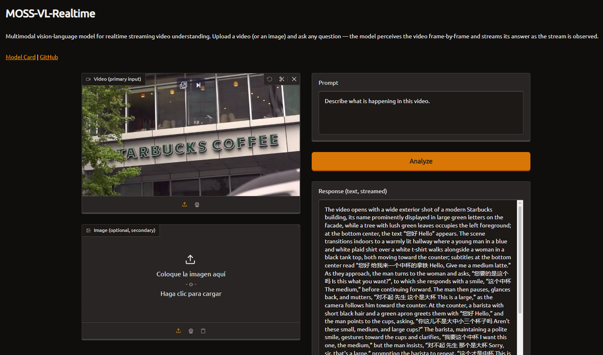

# Ficha de análisis

## 1. Nombre del Space

**Nombre:** MOSS-VL-Realtime

**Enlace:** https://huggingface.co/spaces/OpenMOSS-Team/openmoss-team-moss-vl-realtime

---

## 2. ¿Qué hace el agente?

El agente analiza imágenes o videos que el usuario carga y responde preguntas sobre su contenido. Es capaz de comprender lo que ocurre en cada fotograma del video y generar una descripción en tiempo real mientras procesa la información.

---

## 3. Análisis PEAS

**Performance**

El agente hace bien su trabajo cuando describe de manera precisa lo que aparece en las imágenes o videos y responde correctamente las preguntas del usuario sin omitir detalles importantes.

**Environment**

El agente interactúa con imágenes, videos y con el usuario, quien proporciona preguntas o instrucciones mediante texto.

**Actuators**

El agente me genera texto como respuesta, escribiendo progresivamente el análisis en la interfaz. También puede responder diferentes preguntas según lo que detecta en la imagen o el video.

**Sensors**

Recibe como entrada imágenes o videos cargados por el usuario y un mensaje de texto con la pregunta o instrucción que desea realizar.

---

## 4. Clasificación del entorno

**Observable**

Considero que es **parcialmente observable**, porque aunque el agente puede analizar todo el contenido del video o imagen que recibe, no conoce información externa como el contexto real o las intenciones de las personas que aparecen.

**Determinista**

Diría que **no es determinista**, ya que pequeños cambios en la imagen, el video o incluso en la pregunta del usuario pueden producir respuestas diferentes.

**Episódico**

Sí, es **episódico**, porque cada análisis de una imagen o video es independiente de los anteriores y normalmente no necesita recordar interacciones pasadas para responder.

**Estático**

No, es **dinámico**, especialmente cuando analiza videos en tiempo real, ya que la información cambia constantemente conforme avanza el video.

**Discreto**

No, es **continuo**, porque trabaja con imágenes y videos que contienen información visual continua y no solo un conjunto limitado de estados.

**Conocido**

Sí, considero que es **conocido**, porque el agente sabe cómo interpretar las entradas que recibe y utiliza un modelo previamente entrenado para analizarlas.

---

## 5. ¿Qué tipo de programa de agente creen que es?

Creo que es un **agente con aprendizaje**. Aunque durante el uso no aprende directamente de cada usuario, su funcionamiento depende de un modelo de inteligencia artificial entrenado previamente con grandes cantidades de datos al estilo ChatGPT.

## Imagen de ejemplo de funcionamiento

## 6. Reto adicional

Agentes clasificables como:

1.  **Totalmente observable, determinista y episódico: ** [Baidu - Unlimited-OCR](https://huggingface.co/spaces/baidu/Unlimited-OCR)

### Justificación: 

* **Totalmente observable:** Toda la información necesaria está contenida en la imagen o el PDF que recibe el agente.
* **Determinista:** Para el mismo documento de entrada, el sistema genera el mismo texto extraído bajo las mismas condiciones.
* **Episódico:** Cada imagen o PDF se procesa de forma independiente, sin depender de documentos procesados anteriormente.

2.  **Parcialmente observable, estocástico y secuencial: ** [Qwen - Qwen3-VL Demo](https://huggingface.co/spaces/Qwen/Qwen3-VL-Demo) 

### Justificación:

* **Parcialmente observable:** El agente solo conoce la información proporcionada por el usuario (texto, imágenes y el historial de la conversación), pero no tiene acceso al contexto completo del problema o del entorno.
* **Estocástico:** La respuesta puede variar para la misma consulta debido a la naturaleza probabilística del modelo de lenguaje.
* **Secuencial:** Cada respuesta depende del historial de la conversación ya que los mensajes anteriores influyen en las respuestas más adelante.